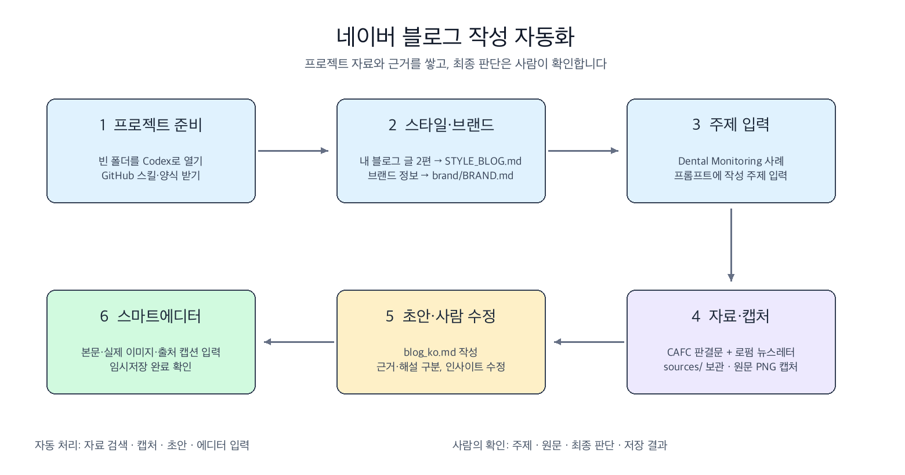

# 네이버 블로그 자동화 개념도

[naver-blog-automation.excalidraw](naver-blog-automation.excalidraw)는 강의 흐름을 보여주는 편집 가능한 Excalidraw 파일입니다. 파일을 내려받아 Excalidraw에서 열면 단계별 문구와 배치를 수정할 수 있습니다.

흐름: 프로젝트 준비 → 스타일·브랜드 설정 → 주제 입력 → 판결문·뉴스레터 수집과 원문 캡처 → 초안·사람 수정 → 네이버 스마트에디터 업로드·임시저장 확인.
